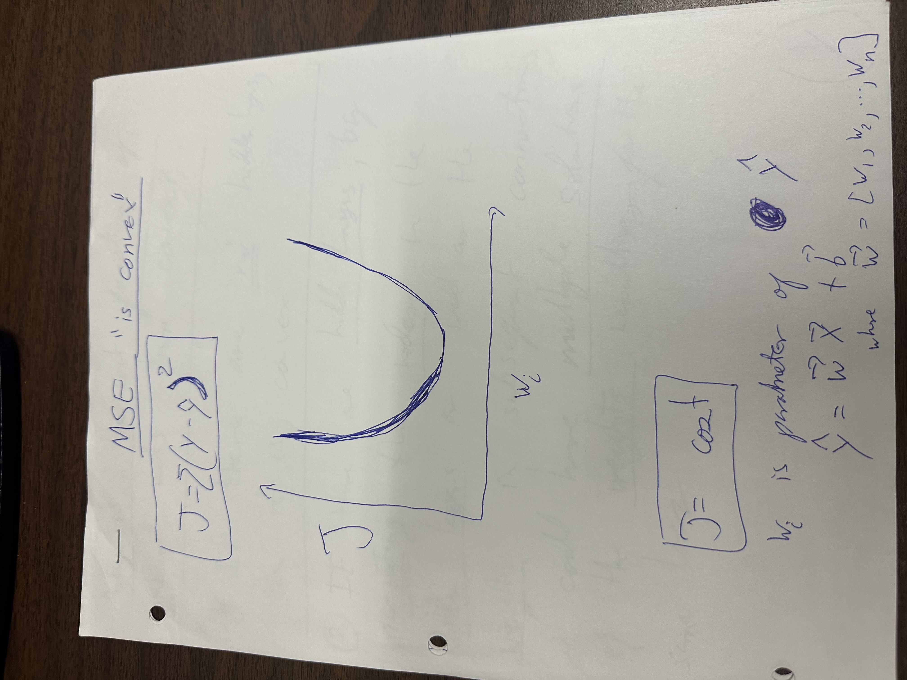

# Problem 01 — Why Are Neural Network Cost Functions Non‑Convex?

## The Chalkboard

**Derivations and challenges behind modern AI.**

---

## Problem

A common statement in machine learning is that **neural network loss functions are non‑convex**, which makes training difficult and leads to multiple local minima.

However, many loss functions used in machine learning — such as **Mean Squared Error (MSE)** — are **convex functions**.

For example:

$$
J = \sum (y - \hat{y})^2
$$

Convex loss functions produce a **bowl‑shaped optimization surface** with a single global minimum when the model is linear in its parameters.

This raises a natural question:

> **If the loss function is convex, why does training a neural network lead to a non‑convex optimization problem?**

---

## Intuition

For simple linear models such as

$$
\hat{y} = \mathbf{w}^T \mathbf{x} + b
$$

optimizing the MSE loss produces a convex optimization problem with a single minimum.

But neural networks introduce **hidden layers and nonlinear transformations**, which dramatically change the structure of the optimization landscape.

Multiple different configurations of weights can produce the **same output function**, which creates multiple equivalent solutions and a more complicated loss surface.

---

## Visual Notes

### Convex Loss Example

The mean squared error loss for a simple linear model produces a convex bowl‑shaped surface.

---

### Neural Network Parameterization

When hidden layers are introduced, the mapping from **weights → predictions** becomes nonlinear.

Different weight configurations can produce the **same network behavior**.

---

### Multiple Solutions in Parameter Space

Because multiple parameter configurations can represent the same function, the optimization surface may contain **multiple minima or flat regions**.

---

## Challenge

Explain **why the cost function of neural networks becomes non‑convex with respect to the parameters**, even when the underlying loss function (such as MSE) is convex.

Your reasoning should consider:

1. The relationship between **model parameters and predictions**.
2. The role of **hidden layers and nonlinear transformations**.
3. The possibility of **multiple parameter configurations producing the same outputs**.

---

## Goal

Provide an argument or derivation showing why neural network training leads to a **non‑convex optimization problem in parameter space**.

No code is required — this is a **conceptual and mathematical reasoning challenge**.

---

## Tags

* Neural Networks
* Optimization
* Convexity
* Deep Learning Foundations
* Machine Learning Theory

---

*Part of the* **The Chalkboard** *repository — a collection of conceptual problems and derivations behind modern AI.*
