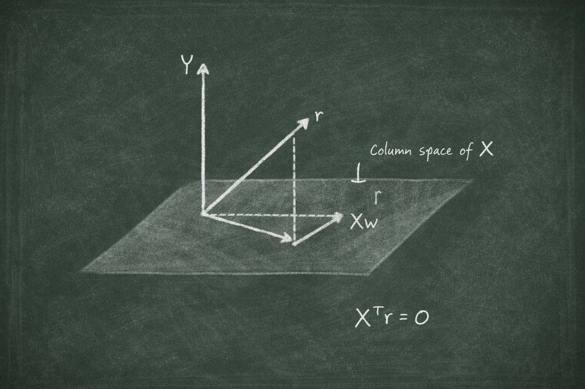

# Where Does $(X^TX)^{-1}X^TY$ Come From?

## The Chalkboard

**Derivations and challenges behind modern AI.**

Contact: rcalix@rcalix.com

---

# Problem

Many machine learning algorithms rely on the analytical least‑squares solution

$$
\tilde{w} = (X^T X)^{-1} X^T Y
$$

This formula appears in:

* Linear Regression
* Control Theory
* Signal Processing
* Statistics
* Machine Learning

However, many practitioners **use the formula without ever deriving it**.

Your task is to derive this expression starting from the least‑squares optimization problem.

---

# Starting Point

Assume a linear model written in matrix form:

$$
Y = Xw
$$

where

* $X$ is the **design matrix**
* $w$ is the **parameter vector**
* $Y$ is the **target vector**

In practice the system is usually **over‑determined**, meaning an exact solution may not exist.

Instead we minimize the squared error:

$$
\tilde{w} = \arg\min_w ||Xw - Y||^2
$$

---

# Visual Intuition

Least‑squares minimizes the **distance between the predicted outputs and the observed data**.

Geometrically, this corresponds to **projecting $Y$ onto the column space of $X$**.

---

# Objective Function

Define the loss function

$$
J(w) = ||Xw - Y||^2
$$

This objective is a **quadratic function of the parameters**.

Because of this structure, the minimum occurs where the **gradient with respect to $w$ equals zero**.

---

# The Challenge

Derive the analytical solution by performing the following steps:

1. Expand the squared error objective

$$
J(w) = (Xw - Y)^T (Xw - Y)
$$

2. Compute the **gradient with respect to $w$**

3. Set the gradient equal to zero

$$
\nabla_w J(w) = 0
$$

4. Rearrange the resulting expression

Show that this leads to the **normal equation**

$$
X^T X w = X^T Y
$$

and therefore

$$
\tilde{w} = (X^T X)^{-1} X^T Y
$$

---

# Geometric Interpretation

The solution corresponds to the **orthogonal projection of $Y$ onto the column space of $X$**.

This means the residual vector

$$
r = Y - X\tilde{w}
$$

is orthogonal to the columns of $X$.

---

# Why This Matters in AI

This derivation is foundational for understanding:

* Linear Regression
* Ridge Regression
* Pseudoinverse solutions
* SVD based learning
* Many optimization methods used in modern AI

Understanding this derivation is the first step toward deeper results such as:

* the **Moore‑Penrose pseudoinverse**
* **SVD based least‑squares solutions**
* **minimum‑norm solutions**

---

the classic least-squares projection diagram:

* a vector Y
* the column space of X (a plane or line)
* the projection Xw
* the residual r
  
Like this conceptually:

        Y
        *
       /
      /
     /|
    / | r
   /  |
  *---*
 
 Xw

where

Y = data

Xw = projection

r = residual

And the key property:

$$
X^T r = 0
$$

which leads to the normal equation.

---

---

# Tags

* Linear Algebra
* Optimization
* Least Squares
* Machine Learning Foundations
* Mathematical AI

---

*Part of* **The Chalkboard** — a collection of derivations and reasoning challenges behind modern AI.
