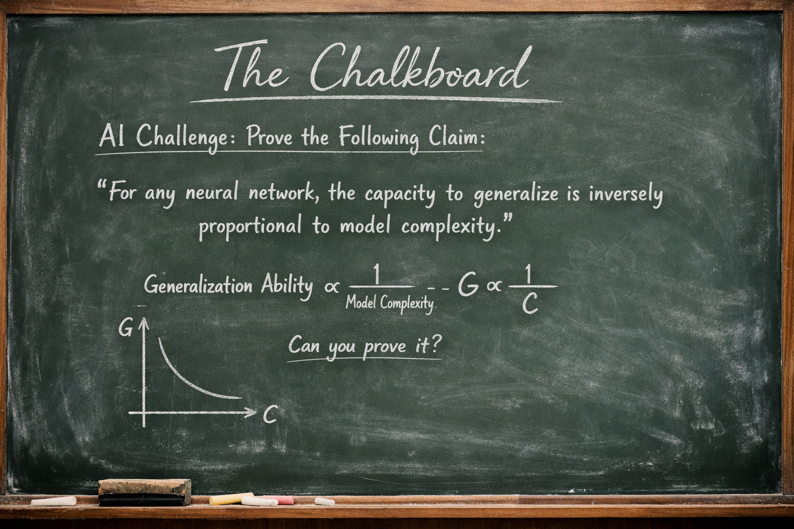

# The Chalkboard

**Derivations and challenges behind modern AI**



Contact: rcalix@rcalix.com

---

Step up to the chalkboard.

This repository contains a collection of mathematical derivations, conceptual puzzles, and AI challenges. Some problems revisit classic results behind machine learning, while others explore ideas that appear in modern artificial intelligence research.

The goal is simple: work through the mathematics yourself.

Some challenges involve proving well-known results (such as least squares solutions or matrix decompositions). Others explore the mathematical intuition behind modern AI systems such as neural networks, optimization methods, and transformer architectures.

Each problem lives in its own folder with a standalone explanation and challenge.

---

## How the Repository is Organized

Each challenge is stored in its own directory and contains a `README.md` with the full description of the problem.

Example structure:

```
the-chalkboard/
│
├── README.md
│
├── chalkboard_01_least_squares/
│   └── README.md
│
├── chalkboard_02_svd/
│   └── README.md
│
├── chalkboard_03_attention/
│   └── README.md
```

---

## Philosophy

Artificial intelligence is often presented as a collection of tools or libraries.
But behind every algorithm lies a mathematical idea.

This repository invites you to revisit those ideas the way they are often discovered:
on a chalkboard.

Think it through.
Derive it.
Prove it.

---


## Topics You May Encounter

Challenges may involve concepts such as:

* Least squares and optimization
* Singular value decomposition (SVD)
* Gradient descent
* Neural network learning dynamics
* Attention mechanisms
* Time series modeling
* AI system interpretation

---

## Contributing

If you would like to contribute a challenge or a derivation, feel free to submit a pull request or email me at rcalix@rcalix.com 

The goal is to build a living chalkboard of ideas behind modern AI.

---

**Step up to the chalkboard.**
